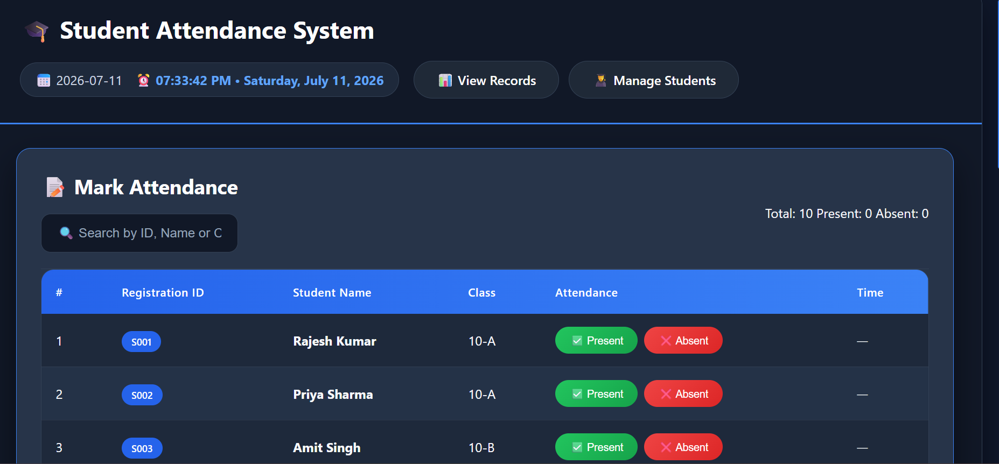
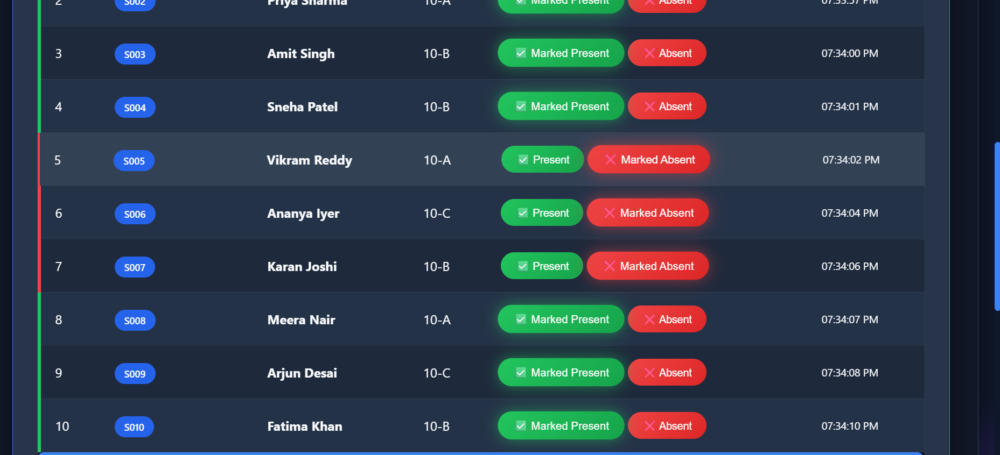
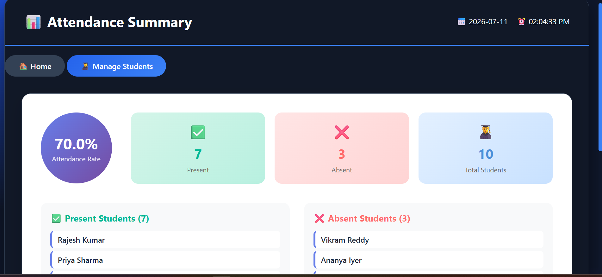
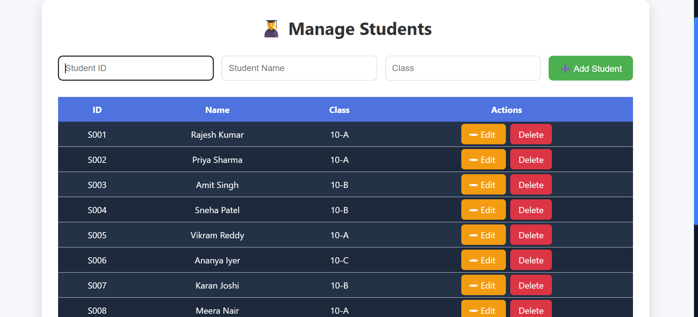
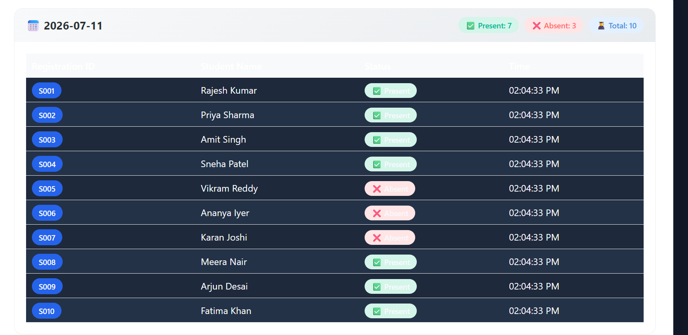
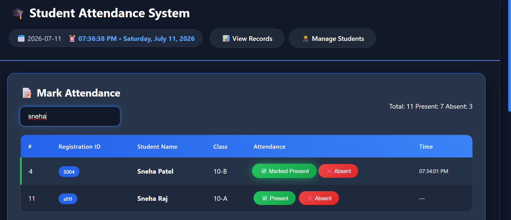

# Student Attendance Management System

A web-based Student Attendance Management System developed using Flask, HTML, CSS, JavaScript, and JSON. The project demonstrates a complete DevOps CI/CD workflow using GitHub, Jenkins, and Docker.

## 📌 Project Overview

The Student Attendance Management System helps manage student attendance digitally. Users can mark students as present or absent, search for students, manage student information, view attendance summaries, and analyze previous attendance records.

The application is containerized using Docker and automatically built and deployed through a Jenkins CI/CD pipeline whenever source code changes are pushed to GitHub.

## ✨ Features

* Mark students as Present or Absent
* Search students by ID, name, or class
* View attendance summary
* Display attendance percentage
* View previous attendance records
* View individual student attendance statistics
* Add new students
* Delete students
* Prevent duplicate Student IDs
* Live attendance statistics
* Dark dashboard user interface
* Responsive web design

## 🛠️ Technologies Used

* Python
* Flask
* HTML5
* CSS3
* JavaScript
* JSON
* Git
* GitHub
* Docker
* Jenkins

## 📂 Project Structure

```text
attendance-devops/
│
├── static/
│   ├── script.js
│   └── style.css
│
├── templates/
│   ├── index.html
│   ├── manage_students.html
│   ├── records.html
│   └── summary.html
│
├── screenshots/
│
├── app.py
├── students.json
├── attendance_records.json
├── requirements.txt
├── Dockerfile
├── Jenkinsfile
└── README.md
```

## 🚀 Installation and Setup

### 1. Clone the Repository

```bash
git clone https://github.com/venkatsai0620/student-attendance-DEVOPS.git
```

### 2. Navigate to the Project Directory

```bash
cd student-attendance-DEVOPS
```

### 3. Install Required Dependencies

```bash
pip install -r requirements.txt
```

### 4. Run the Flask Application

```bash
python app.py
```

### 5. Open the Application

Open the following address in your browser:

```text
http://localhost:5000
```

## 🐳 Docker Deployment

Build the Docker image:

```bash
docker build -t student-attendance-app .
```

Run the Docker container:

```bash
docker run -d -p 5000:5000 --name attendance-container student-attendance-app
```

The application will be available at:

```text
http://localhost:5000
```

## 🔄 CI/CD Pipeline

This project uses Jenkins and Docker to implement an automated CI/CD deployment workflow.

The pipeline performs the following stages:

1. Jenkins detects source code changes from GitHub.
2. Jenkins downloads the latest source code.
3. Docker builds a new application image.
4. The existing Docker container is stopped.
5. The old container is removed.
6. A new Docker container is deployed using the latest image.
7. The updated Flask application becomes available on port 5000.

### CI/CD Workflow

```text
Developer
    ↓
Git Commit and Push
    ↓
GitHub Repository
    ↓
Jenkins Pipeline Trigger
    ↓
Checkout Source Code
    ↓
Build Docker Image
    ↓
Stop and Remove Old Container
    ↓
Run New Docker Container
    ↓
Updated Application Deployed
```

## 📸 Application Screenshots

### Home Page



### Attendance Marking



### Attendance Summary



### Manage Students



### Attendance Records



### Search Student



## 🎯 DevOps Tools and Purpose

| Tool    | Purpose                       |
| ------- | ----------------------------- |
| Git     | Source code version control   |
| GitHub  | Remote source code repository |
| Jenkins | CI/CD pipeline automation     |
| Docker  | Application containerization  |
| Flask   | Backend web framework         |

## 📊 Project Outcome

The project successfully demonstrates the development and automated deployment of a Flask-based Student Attendance Management System.

The Jenkins CI/CD pipeline automatically detects source code changes, builds a new Docker image, removes the previous application container, and deploys the latest version of the application.

## 👨‍💻 Author

Venkata Sai Pithani

## 📚 Project Title

Student Attendance Management System – DevOps Project

## Live Application

The Student Attendance Management System is deployed on Render.

Live Website:
https://student-attendance-devops.onrender.com
